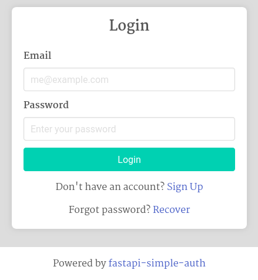

# Quickstart

## Authentication easy as three lines!

1. Import package
2. hook to app with `SimpleAuth(app)`
3. add `user: logged_in_user` to protected view

~~~python
from fastapi import FastAPI
from fastapi_simple_auth import SimpleAuth, logged_in_user
        
app = FastAPI()

simpleauth = SimpleAuth(app)

@app.get("/")
async def read_users_me(user: logged_in_user) -> str:    
    return f"Hello {user.username} {user.uuid}"
~~~

